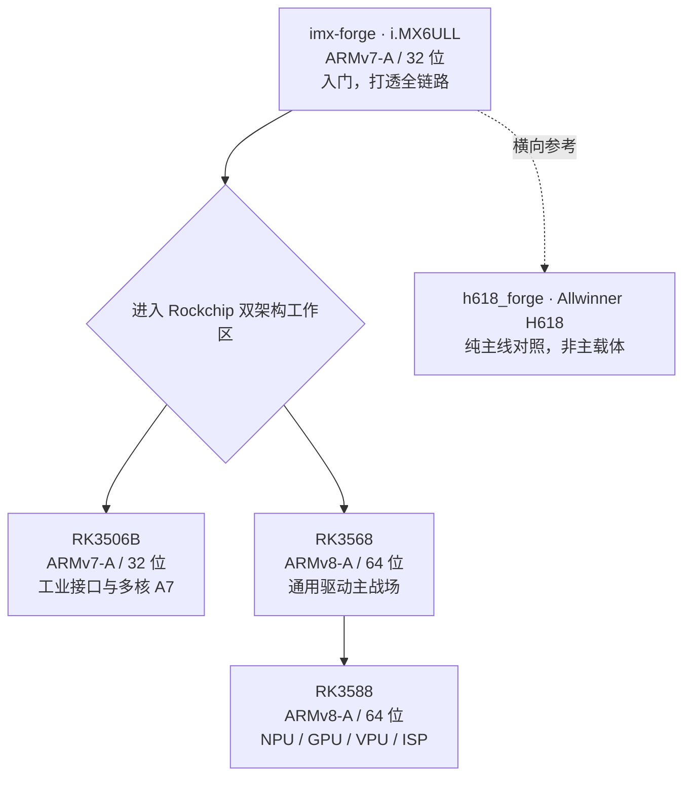

# P2 · 嵌入式 Linux

通用 Linux 内核机制用 QEMU 在 [P0](/roadmap/01-fundamentals/) 学过了（PenguinLab）。P2 只搞一件事：在某块 ARM 板子上把 Linux 跑起来、调通、做出东西。

这些平台都属于 Cortex-A / Linux 世界，但不是同一套 ABI。P2 明确横跨 ARM 32 位和 ARM 64 位：学习能力可以递进，工具链、启动模型、rootfs 和二进制产物不能混在一起。

## Linux forge 的脾气：两头都要

这边的 forge 和单片机不一样，既是教学站也是功能站。教你跑通 Linux，同时产出真能用的工具（buildmeter 给那种几十分钟的内核编译做进度显示，就是例子）。不是纯教学，也不是纯生产，两头都要。

## 平台分工

- **imx-forge（i.MX6ULL，入门）**：单核 Cortex-A7，最简单，资料最厚（正点原子、韦东山、野火三家）。打透 U-Boot、内核、设备树、rootfs、驱动、Buildroot 一整条链。招牌是双轨内核——NXP 的 BSP 对比主线，看厂商为什么要打 patch。已发布、成熟晚期，定位、规划、项目见 [imx-forge 专页](/roadmap/03-linux/imx-forge)。
- **rk-forge（Rockchip 平台）**：一个仓库横跨 32 位 RK3506B 与 64 位 RK3568 / RK3588。三板形成平台梯度，但工具链、启动架构和 ABI 分开讲；所有课程以对应真板验证为验收目标。完整大纲见 [rk-forge 专页](/roadmap/03-linux/rk-forge)。
- **h618_forge（LubanCat-A1 / Allwinner H618，横向参考）**：已经形成从主线 U-Boot、自建 TF-A、主线 Linux 到自建 Buildroot rootfs 和 HDMI 输出的纯主线工作区，并保留真板验证日志。它用来对照“主线优先”与厂商 BSP 路径的差异，不是 RK3588 的后继，也不挤入 i.MX6ULL → Rockchip 的主脊柱。

i.MX6ULL 负责把 32 位 Linux 全链路讲透；进入 rk-forge 后，RK3506B 延续 32 位并补 Rockchip 工业平台经验，RK3568 建立 64 位通用驱动基线，RK3588 再进入高性能专题和 Android。三块 RK 板共用工作区和方法论，但绝不共用未经区分的工具链与构建产物。学习路线用 Buildroot 当主要载体，细节见专页。

## 基建项目

三个项目承担跨平台基建，中心站只同步其当前职责，不另行改写定位：

- **CFBox**：C++23 写的 BusyBox 替代，当前提供 123 个 applet、399 项测试；体积优化构建约 418 KB，并已在 i.MX6ULL 上作为 PID 1 运行。
- **lightroot**：更易用的 Buildroot 风格 rootfs 构建器，已经公开，当前处于 Stage 1。
- **buildmeter**：从平台仓内部工具独立出来的构建进度工具，为 Linux Kernel、U-Boot 和 Buildroot 的 GNU make 构建提供阶段、进度与 ETA。

## 往下走

RK3588 上的驱动、媒体与 AI 实验继续留在 [rk-forge 专页](/roadmap/03-linux/rk-forge)内，桌面产品直接进入 [CFDesktop](/projects/cfdesktop)。独立专题当前均已推迟，不作为 P2 的必经下一站。
