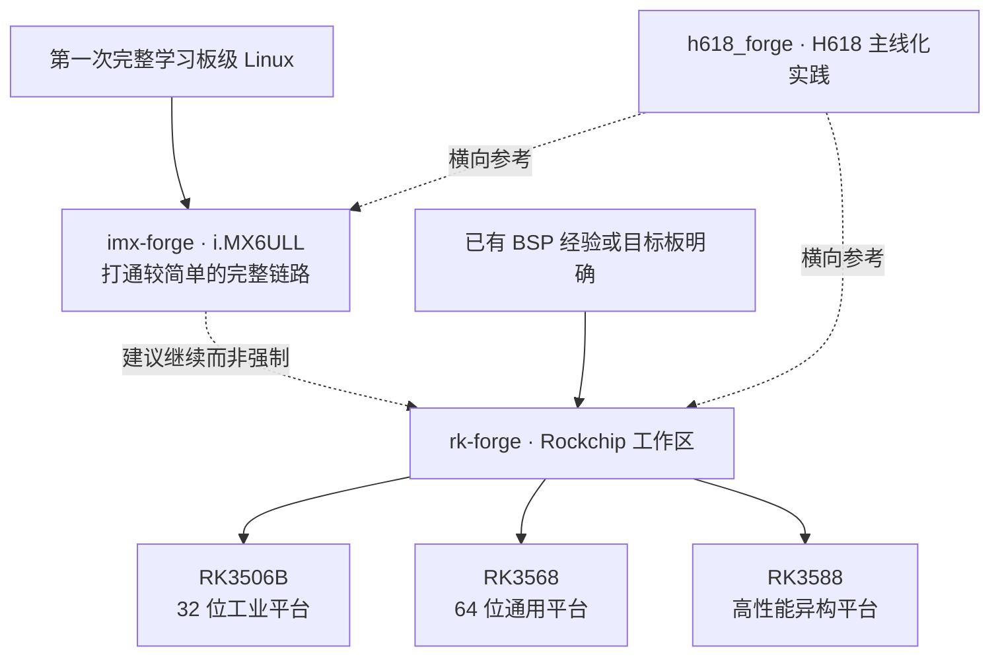

# 嵌入式 Linux 实践

这一方向把工具、C/C++ 和 Linux 基本功带到真实 ARM 板：构建并启动 U-Boot、内核和 rootfs，修改设备树与驱动，部署用户空间程序，并留下可复查的板端证据。

## 怎样选择平台

- [imx-forge](/roadmap/03-linux/imx-forge) 适合第一次打通完整链路。i.MX6ULL 平台较简单，资料充足，仓库已经形成版本发布、可复现构建和真板验收。
- [rk-forge](/roadmap/03-linux/rk-forge) 面向 RK3506B、RK3568 和 RK3588。三块板共享工作区和方法，但不共享未经区分的 ABI、工具链和构建产物；学习者按背景和目标选择，不要求依次购买全部开发板。
- [h618_forge](/projects/h618-forge) 提供 Allwinner H618 的主线 U-Boot、TF-A、Linux 与 rootfs 横向参考，不是固定后继路线。

## 系统知识与平台实践允许交叉

[PenguinLab](/projects/penguin-lab) 用 QEMU 解释通用 Linux 内核、系统编程和调试机制。它可以在买板前学习，也可以在 BSP 实践遇到中断、内存、驱动或调试问题后回来深化。

平台 forge 仍然会在具体上下文中重新解释必要内容：会在 QEMU 中观察内核机制，不等于已经理解某块 SoC 的启动链、厂商补丁、设备树和电气事实。

## 工程项目与基建

| 仓库 | 职责 | 与平台 forge 的关系 |
|---|---|---|
| [CFBox](/projects/cfbox) | Linux userspace 高阶工程 | 已通过 imx-forge 在真板上作为 PID 1 验证 |
| [buildmeter](/projects/buildmeter) | 长时间构建的进度与可观测性基建 | 被 imx-forge 和 rk-forge 以固定版本消费，不是学习节点 |
| [lightroot](/projects/lightroot) | typed IR、依赖和 rootfs 的构建系统实验 | 最小 QEMU/真板 rootfs 闭环完成前，不宣称替代 Buildroot |

产品项目可以使用这些平台完成部署和验收，但不会因此成为嵌入式 Linux 课程的统一终点。

## 验收证据

平台仓库应尽量留下可以复查的交付证据：源码版本、工具链和配置、构建命令、产物 hash、串口或测试日志、目标板信息、已知限制和迁移说明。QEMU 可以降低学习门槛，真板仍负责验证启动介质、外设、电气和平台兼容。
