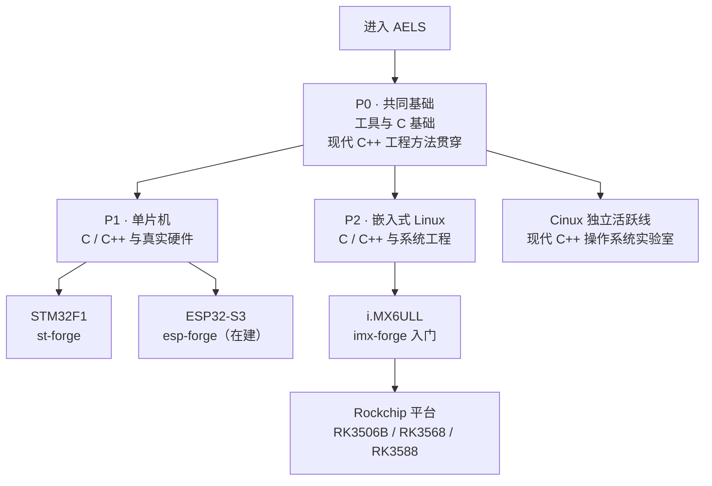

# 嵌入式学习地图

不知道从哪开始？先建立共同基础，再从单片机、嵌入式 Linux 或 Cinux 中选择一条主线。P1 与 P2 平行，不需要相互作为前置。

> 状态基线：2026-07-25。中心站记录仓库定位、公开状态和已经核实的平台事实；实现进度与版本细节以各仓库当前 README 和验证记录为准。
> 需要注意的是，AELS还很年轻，需要一些时间沉淀，如果您有想法，欢迎联系我们一起添砖加瓦！

> 这张图只表达当前学习主线，不承载横向参考、仓库成熟度、公共库依赖和产品去向。那些信息放在各路线专页与[项目目录](/projects/)中维护。

## 四个部分各自回答什么

| 路线 | 核心问题 | 当前载体 |
|---|---|---|
| [P0 · 共同基础](/roadmap/01-fundamentals/) | 怎样建立可迁移的工具、C/C++ 与工程能力？ | EmbedBox、C-Journey、ModernCPP；再按需要进入 FreeRTOS、PenguinLab、AwesomeHardware、AwesomeQt |
| [P1 · 单片机](/roadmap/02-mcu/) | 怎样在资源受限系统里控制真实硬件？ | STM32F1 的 st-forge；ESP32-S3 的私有 esp-forge |
| [P2 · 嵌入式 Linux](/roadmap/03-linux/) | 怎样完成从启动链到应用的板级系统工程？ | i.MX6ULL 入门，Rockchip 横跨 32/64 位，H618 作主线化横向参考 |
| [Cinux 独立线](/roadmap/04-specialty/) | 怎样用现代 C++ 从零理解操作系统？ | Cinux、Cinux-Book、Cinux-Base、Cinux-GUI |

现代 C++ 不是图外的选修装饰。它是 AELS 区分于常规嵌入式教程的工程方法主线，贯穿 MCU、嵌入式 Linux、Cinux 和产品项目；但“贯穿”不等于要求学习者先完成整套 ModernCPP 才能进入平台实践。

## 平台顺序与边界

- **P1 是双入口，不是先后关系。** st-forge 以 STM32F1 / Cortex-M3 打透裸机与基础架构；esp-forge 围绕现有 ESP32-S3 开发板进入 ESP-IDF、双核 RTOS、无线与 USB。
- **P2 有主脊柱。** imx-forge 用 i.MX6ULL 打通入门全链路；随后进入 rk-forge，分别处理 RK3506B 的 32 位环境和 RK3568 / RK3588 的 64 位环境；h618_forge 只承担横向参考。
- **Cinux 是独立活跃线。** 它从 P0 的 C/C++ 与系统基础直接进入，不要求先走 P1 或 P2。
- **专题不是当前下一站。** GUI、网络、独立驱动课程、多媒体和边缘 AI 只保留规划，现阶段不与 forge 和 Cinux 主线争夺建设资源。

## 三条原则

**Windows 是受支持的入口，不是对所有工具的统一承诺。** 通用工具与主机课程尽量提供 Windows、WSL2 和 Linux 路径；嵌入式 Linux 构建仍可能以 Linux、WSL2 或容器为主，具体支持以各仓当前文档和验证记录为准。

**概念先学，实战再去。** FreeRTOS 调度理论在 P0 用上位机学，真上板在 P1；Linux 内核机制用 QEMU 在 P0 学，板子 bring-up 在 P2。同一套东西，理论和实战分开，不重复教。

**单片机默认先过可模拟部分。** STM32F1 用自研 micro-forge，ESP32-S3 用乐鑫 QEMU 加 Wokwi；随后回到真板验证时序、电气、功耗、无线和 USB。模拟是降低门槛与接入 CI 的手段，不替代实机结论。
