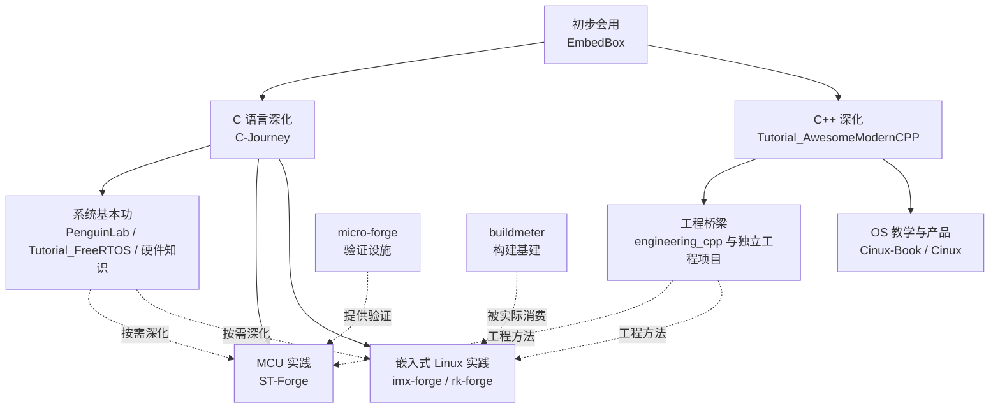

# AELS 学习关系

AELS 的仓库不是一条只能向前走的流水线。常见顺序是先学会使用工具，再把 C/C++ 学深，继而补足系统基本功并进入 MCU 或嵌入式 Linux；但学习者可以根据已有能力直接进入任意一层，在实践中发现缺口后再返回补课。



这张图只画稳定的学习关系，不承诺每个仓库的未来终点，也不把产品和基建伪装成课程阶段。

## 怎样理解图中的关系

| 关系 | 含义 | 示例 |
|---|---|---|
| 建议继续 | 常见且自然的学习顺序，但不是强制门禁 | EmbedBox 之后继续学习 C-Journey 或 ModernCPP |
| 按需深化 | 可以提前学习，也可以在实践中遇到问题再回来补 | 用 PenguinLab 理解 Linux 内核机制 |
| 工程桥梁 | 把语言知识带入需求、设计、测试、版本和下游消费 | engineering_cpp 与 SimpleIniParser |
| 提供验证 | 支撑课程或产品验证，本身不是固定下一课 | micro-forge 支撑部分 STM32 固件实验 |
| 被实际消费 | 通过固定依赖或交付契约进入真实工程 | imx/rk 使用 buildmeter |
| 稳定重放 | 产品继续前进，教学仓库选择稳定能力讲解 | Cinux-Book 重放 Cinux 稳定能力 |

## 四个学习区域

### [工具、语言与工程基础](/roadmap/01-fundamentals/)

EmbedBox 负责先会使用，C-Journey 与 ModernCPP 分别为 C 和 C++ 深入；工程项目负责把语言能力送进完整交付过程。它们会合理交叉，不按“一个知识点只能属于一个仓库”切割。

### [MCU 实践](/roadmap/02-mcu/)

当前以 ST-Forge 为建设主线。Tutorial_FreeRTOS、AwesomeHardware 和 micro-forge 分别提供概念、硬件与模拟支持；BareMetal-Drivers 可以接收成熟资产，但没有预设的统一结课产品。

### [嵌入式 Linux 实践](/roadmap/03-linux/)

imx-forge 适合第一次打通完整板级链路；rk-forge 根据开发板与目标选择平台；h618_forge 提供主线化横向参考。PenguinLab、CFBox、buildmeter 和 lightroot 各自承担系统知识、工程项目或基建职责。

### [Cinux：产品与教学重放](/roadmap/04-specialty/)

Cinux 持续探索前沿操作系统能力，Cinux-Book 负责选择稳定切片进行教学重放。公共基础类型和 GUI 代码收拢到 Cinux 内部，避免用多个仓库放大维护压力。

## 共同验证底线

```text
人审知识陈述
    → 示例能够编译
    → 正反行为测试
    → Host / 模拟器 / QEMU 运行
    → 真板或真实产品完成工程交接
```

并非每个仓库都必须同时具备全部层次。中心站会说明当前证据停在哪里：Host 和模拟器可以证明功能语义与确定性行为，但不能替代实时性、电气、功耗、射频和真板时序。

## 版本怎样协作

AELS 不要求所有仓库共享同一个组织版本。发生教学或工程交接时，由提供方给出一个推荐 Tag 或 SHA，并随能力切片说明前置知识、文件映射、构建测试命令、预期结果、已知限制和迁移方式。尚未形成稳定切片的仓库继续标记为建设中，不用虚构版本成熟度。
